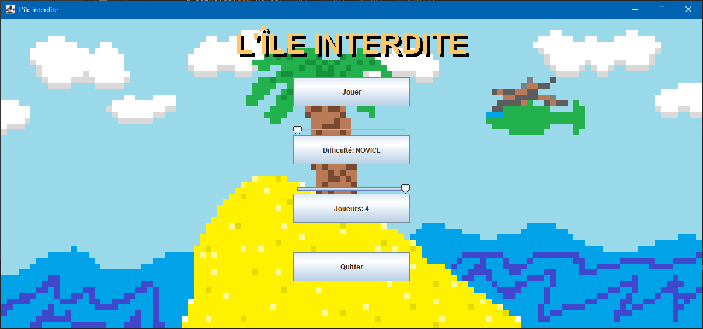
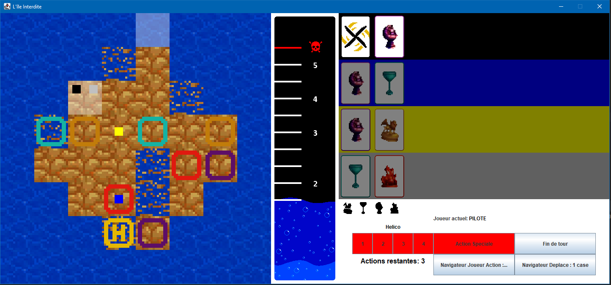

## Menu Principal du jeu

  

## Un petit overview du gameplay

    

## Quelque explication

    

## Action Possible

Appuie sur 1,2,3,4(ou le bouton correspondant) pour (dés)activer le fait qu'on transporte le joueur avec l'hélicot

Appuie sur n(ou le bouton correspondant) pour (dés)activer le pouvoir spécial du navigateur ou du pilote

Appuie sur m(ou le bouton correspondant) pour changer la distance auquel le navigateur déplace la personne

Appuie sur espace(ou le bouton correspondant) pour changer le joueur qui est déplacé par le navigateur

Appuie sur r pour reset la case clicker en cas de problème

On utilise les fleche pour se déplacer ou déplacer avec le navigateur

On utilise clic gauche pour se déplacer et clic droit pour assécher une case

Pour utiliser la carte hélicoptere faut clic gauche sur la carte 
puis click droit sur la case où sont les joueurs à transporter
puis click gauche sur la case où ils seront transporté

Pour utiliser la carte sac de sable clic gauche sur la carte 
puis clic gauche sur la case à assécher

Pour échanger les cartes on drag la carte trésor qu'on veut donner
vers la pile de carte du joueur 

## Ce qu'on a fait

On a la pile de carte trésor et inondation

On a fait les actions spéciales des différents rôles et cartes

On a aussi fait l'échange de carte

On a aussi des sprites et un main menu + tous les trucs basics du jeu

On a aussi une animation quand on gagne ou on perd
les perte qu'on a fait sont noyade, trésor plus récupérable et héliport qui
est submergé

On a aussi rajouté des sons pour certaine action

## Quelques problèmes qu'on a pas résolue

Lorsqu'un joueur est sur une case qui se fait submergé on le laisse 
à son endroit à la place de le déplacer sur une des cases adjacentes

## Diagramme de classe

  

